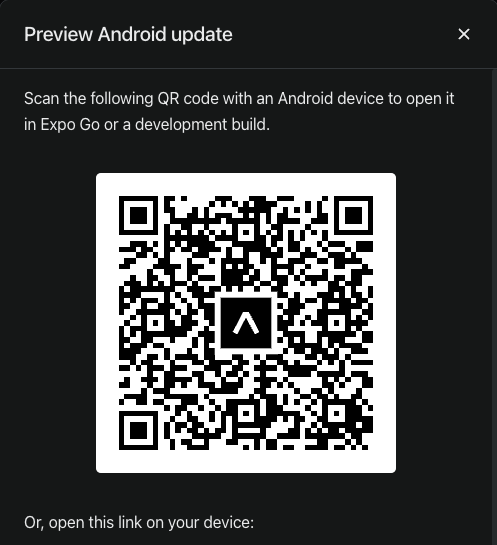

# igniteteams

### Technologies used in the project:

- React-Native
- Expo
- React-native-async-storage/async-storage
- Typescript

### Command to run the project:

```jsx
npm run start ou yarn start ou npx expor start

```

This is a simple project, developed to solidify my knowledge in React Native.

I chose to implement the **DDD (Domain-Driven Design)** pattern in this project, even though it's a simple application. The primary reason for this decision was to further refine my understanding and practice of these concepts.

A highlight of this project is the clear **separation between the user interface (UI) and the business rules**. This division not only makes future maintenance more efficient, but also facilitates potential code evolutions.

**Example**: The adapter I created for `async-storage` can easily be refactored to integrate with an API, without needing to modify other parts of the code.

Regarding tests, I focused them on the most critical part of the application. In this context, tests were applied exclusively to the `repository`, since it simulates a backend.

<div style="display: flex; justify-content: space-between;">


</div>

<div style="width: 100%; display: flex; justify-content: center;">
<video src="./doc/mobile7.mov" width="250" height="500" controls />
</div>

### Run the project with IOS:

Download the Expo Go app, then read the QR-Code below:

<div style="display: flex; justify-content: align-items: center;">

</div>

### Run the project with Android:

Download the Expo Go app, then read the QR-Code below:

<div style="display: flex; justify-content: align-items: center;">

</div>
